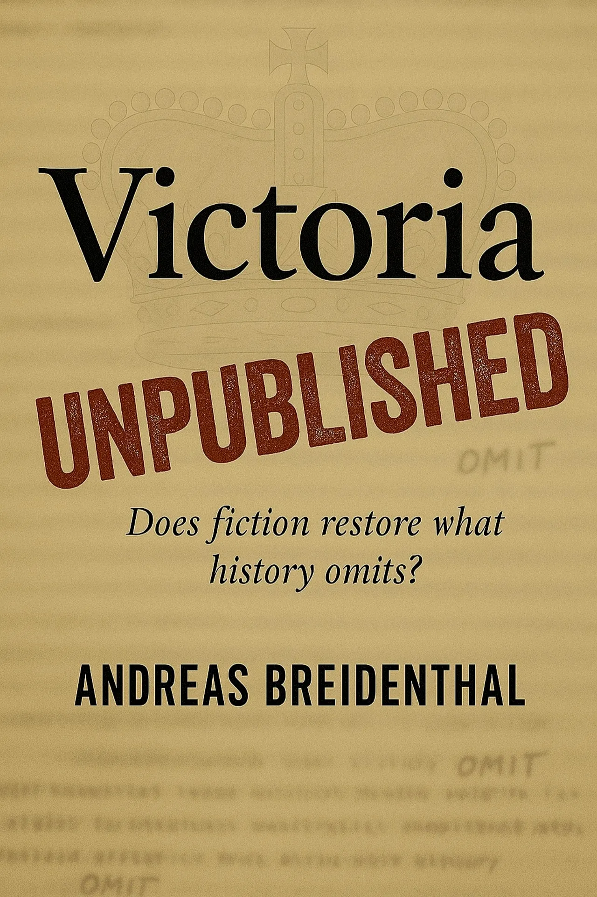

# Victoria Unpublished

**_Does fiction restore what history omits?_**

*A Recovered Archive, 1837 & 1909–1913*

Presented by Andreas Breidenthal

---

*Victoria Unpublished* is a work of fiction presented in two modes: a first-person narrative and a scholarly dossier. It examines how a young sovereign's private pages from June–July 1837 might be shaped for public reading — what is withheld, what is substituted, and why.

Blending invented materials with authentic editorial methods, the book explores the necessity — or otherwise — of sanitising a public voice. What begins as a pursuit and a decision becomes an enquiry into restraint and excess.

*This is a work of fiction. All events, procedures, and characters are invented. No institution referenced endorses this work.*

[Begin Reading →](https://andreas-breidenthal.github.io/victoria-unpublished/ch01.html)

## The Narrative

1. [The Sale](https://andreas-breidenthal.github.io/victoria-unpublished/ch01.html)
2. [The Making](https://andreas-breidenthal.github.io/victoria-unpublished/ch02.html)
3. [The Shadow](https://andreas-breidenthal.github.io/victoria-unpublished/ch03.html)
4. [The Journal](https://andreas-breidenthal.github.io/victoria-unpublished/ch04.html)
5. [The Book](https://andreas-breidenthal.github.io/victoria-unpublished/ch05.html)
6. [The Confrontation](https://andreas-breidenthal.github.io/victoria-unpublished/ch06.html)
7. [The Papers](https://andreas-breidenthal.github.io/victoria-unpublished/ch07.html)
8. [The Gatekeepers](https://andreas-breidenthal.github.io/victoria-unpublished/ch08.html)
9. [The Bedchamber](https://andreas-breidenthal.github.io/victoria-unpublished/ch09.html)
10. [The Meeting](https://andreas-breidenthal.github.io/victoria-unpublished/ch10.html)
11. [The Appointment](https://andreas-breidenthal.github.io/victoria-unpublished/ch11.html)
12. [The Client](https://andreas-breidenthal.github.io/victoria-unpublished/ch12.html)
13. [The Terms](https://andreas-breidenthal.github.io/victoria-unpublished/ch13.html)
14. [The Job](https://andreas-breidenthal.github.io/victoria-unpublished/ch14.html)
15. [The Archives](https://andreas-breidenthal.github.io/victoria-unpublished/ch15.html)
16. [The Cellars](https://andreas-breidenthal.github.io/victoria-unpublished/ch16.html)
17. [The Window](https://andreas-breidenthal.github.io/victoria-unpublished/ch17.html)
18. [The Favour](https://andreas-breidenthal.github.io/victoria-unpublished/ch18.html)
19. [The Placement](https://andreas-breidenthal.github.io/victoria-unpublished/ch19.html)
20. [The Process](https://andreas-breidenthal.github.io/victoria-unpublished/ch20.html)
21. [The Rhythm](https://andreas-breidenthal.github.io/victoria-unpublished/ch21.html)
22. [The Anomaly](https://andreas-breidenthal.github.io/victoria-unpublished/ch22.html)
23. [The Leaves](https://andreas-breidenthal.github.io/victoria-unpublished/ch23.html)
24. [The Wait](https://andreas-breidenthal.github.io/victoria-unpublished/ch24.html)
25. [The Custody](https://andreas-breidenthal.github.io/victoria-unpublished/ch25.html)
26. [The Decision](https://andreas-breidenthal.github.io/victoria-unpublished/ch26.html)

## The Dossier

* [Foreword to Transcripts and Analysis](https://andreas-breidenthal.github.io/victoria-unpublished/foreword.html)  
  *Presented by Andreas Breidenthal*
* [Archivist's Note — Ashcombe Journal](https://andreas-breidenthal.github.io/victoria-unpublished/archivists-note-journal.html)  
  *Reference: AB/LAJ/1909–1913 (Private)*
* [Ashcombe Journal (Transcript)](https://andreas-breidenthal.github.io/victoria-unpublished/ashcombe-journal.html)  
  *Cloth-bound notebook, 1909–1913*
* [Archivist's Note — Accession Typescript](https://andreas-breidenthal.github.io/victoria-unpublished/archivists-note-typescript.html)  
  *Reference: AB/VJ-TS/1837 (Private)*
* [Accession Typescript (Transcript)](https://andreas-breidenthal.github.io/victoria-unpublished/accession-typescript.html)  
  *20 June–13 July 1837 · with editorial annotations*
* [The Queen Unpublished](https://andreas-breidenthal.github.io/victoria-unpublished/analysis.html)  
  *An editorial analysis of the Accession Typescript*

## Closing Matter

* [Afterword](https://andreas-breidenthal.github.io/victoria-unpublished/afterword.html)  
  *The making of Victoria Unpublished*
